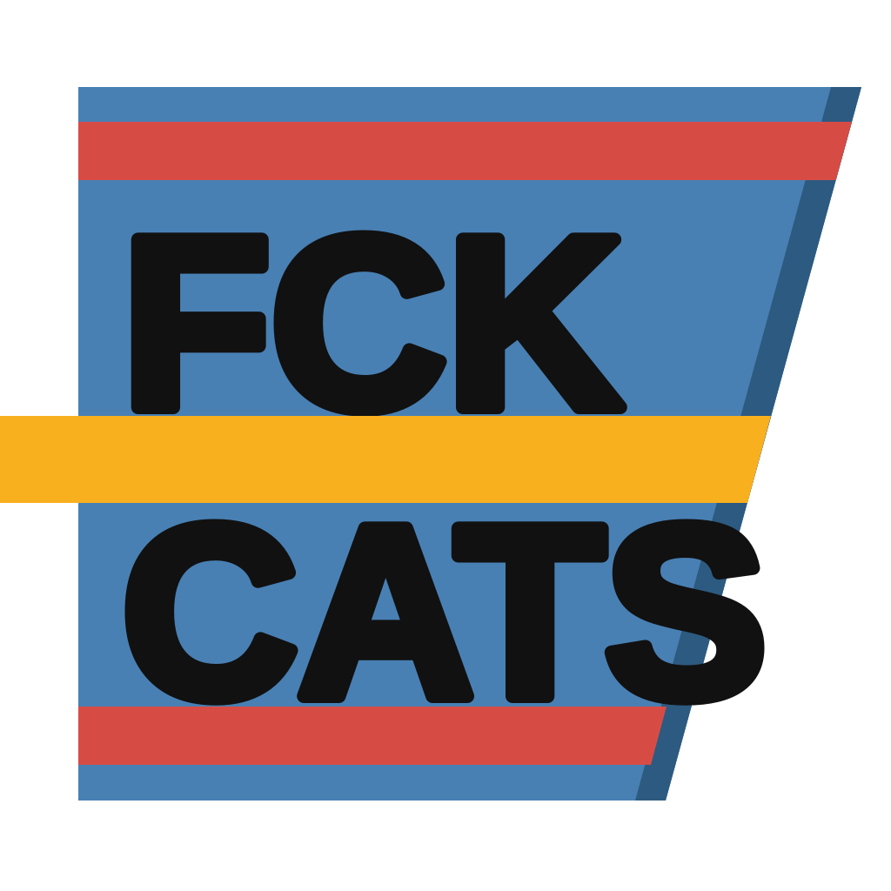
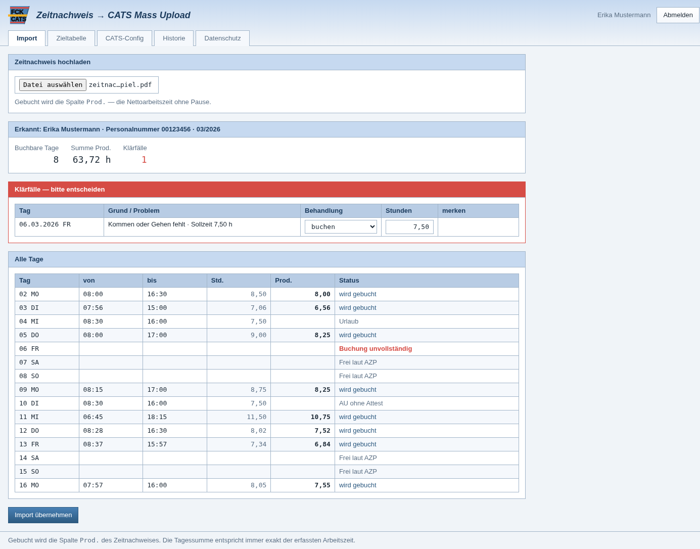
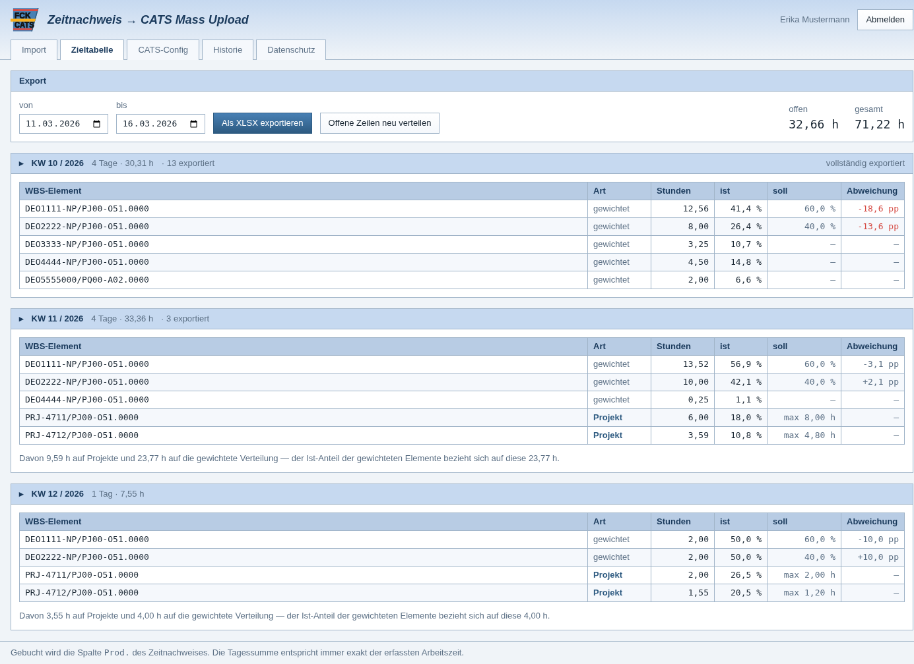
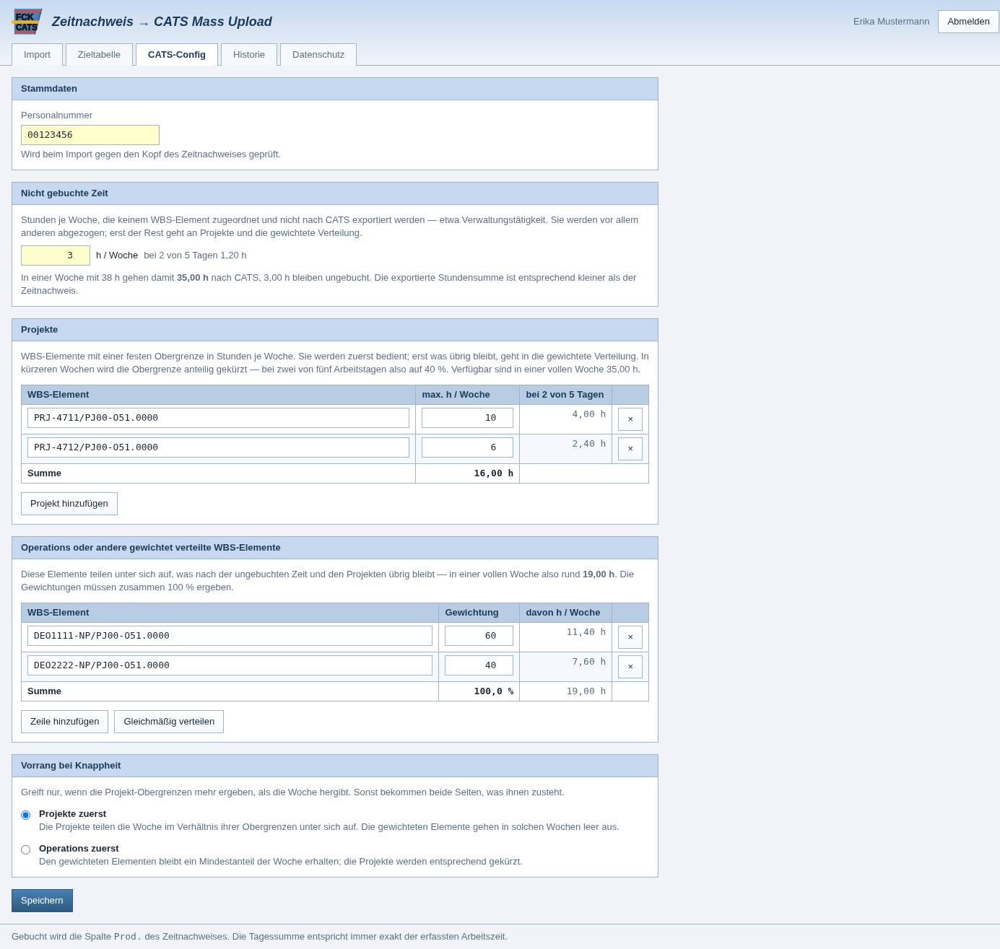
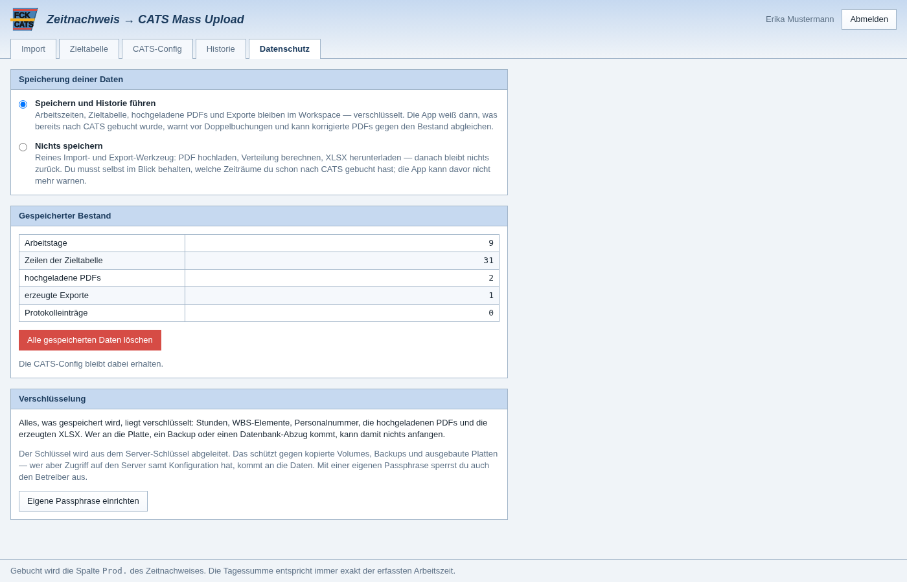

<p align="center">
  
</p>

<h1 align="center">fckcats</h1>

<p align="center">
  <strong>F</strong>etch &nbsp;–&nbsp; <strong>C</strong>heck &nbsp;–&nbsp; <strong>K</strong>omplete
</p>

<p align="center">
  Zeitnachweis-PDF rein, SAP-CATS-Mass-Upload-XLSX raus.
</p>

---

Wer seine Arbeitszeit in einem Zeiterfassungssystem stehen hat und sie anschließend
in SAP CATS auf Projekte buchen muss, macht das üblicherweise von Hand: Tag für Tag
ablesen, auf WBS-Elemente verteilen, in die Upload-Tabelle tippen. fckcats nimmt das
Zeitnachweis-PDF entgegen, prüft es, verteilt die Stunden nach einer hinterlegten
Gewichtung auf die WBS-Elemente und erzeugt die fertige Upload-Datei.

**Die Zusage dabei:** die Tagessumme der erzeugten Zeilen entspricht immer exakt der
tatsächlich geleisteten Arbeitszeit. Es wird nichts gerundet, gekürzt oder erfunden —
nur anders auf Projekte aufgeteilt.



## Was die App macht

**PDF einlesen.** Der Zeitnachweis wird per `pdftotext -layout` ausgewertet, die
Spalten werden über ihre Position im Kopf zugeordnet. Kein OCR, keine externe
Abhängigkeit.

**Richtig rechnen.** Gebucht wird die Spalte `Prod.` (Nettoarbeitszeit), nicht `Std.`
(Anwesenheit inklusive Pause). Nur die Prod-Summe trifft die im Zeitnachweis
ausgewiesenen Produktivstunden.

**Abwesenheiten aussortieren.** Urlaub, Krankheit, Zeitausgleich, Reisezeit und freie
Tage fallen raus — auch dann, wenn in der Std-Spalte trotzdem 7,50 steht. Das ist die
Falle, in die eine naive Auswertung tappt.

**Nachfragen statt raten.** Ein unbekannter Grundtext (`Dienstreise`, `Fortbildung`)
oder ein Tag mit vergessener Kommen-/Gehen-Buchung wird nicht stillschweigend gebucht,
sondern als Klärfall vorgelegt. Getroffene Entscheidungen merkt sich die App.

**Verteilen.** Die Stunden werden je ISO-Woche auf die WBS-Elemente verteilt, in
möglichst groben Blöcken (4 h vor 2 h vor 1 h). Dabei gibt es zwei Gruppen:
**Projekte** mit einer festen Obergrenze in Stunden je Woche werden zuerst bedient,
**Operations** teilen sich nach Gewichtung, was übrig bleibt. Jede Woche sieht anders
aus, die Tagessummen stimmen immer.

**Buchhaltung führen.** Die Zieltabelle liegt in der Datenbank, nicht in der Datei.
Exportierte Zeilen sind markiert, ein korrigiertes PDF für einen bereits gebuchten
Zeitraum verlangt eine ausdrückliche Bestätigung, und die ersetzte Fassung bleibt in
der Historie einsehbar.





## Verteilalgorithmus

Zwei Regeln mit klarer Rangfolge:

1. **Hart** — die Tagessumme entspricht exakt der validierten Stundenzahl.
2. **Weich** — die Gewichtung soll je Woche möglichst gut getroffen werden.

**Projekte gehen vor.** Ihre Obergrenze wird anteilig zur Wochenlänge gekürzt (zwei
von fünf Arbeitstagen → 40 %), erst der Rest geht in die gewichtete Verteilung.
Ergeben die Obergrenzen mehr, als die Woche hergibt, entscheidet ein Schalter, wer
nachgibt: entweder teilen die Projekte die Woche unter sich auf, oder den gewichteten
Elementen bleibt ein festgelegter Mindestanteil.

Exakt kann die Wochengewichtung nicht aufgehen, weil die Tagesstunden krumm sind
(7,83 h lässt sich nicht sauber in 40/25/15/15/5 zerlegen). Die App rechnet deshalb
200 Zufallsvarianten durch und nimmt die wochenscharf beste. Was pro Woche übrig
bleibt, wird in die Folgewoche übertragen — dadurch stimmt die Gewichtung über den
Gesamtzeitraum sehr genau, auch wenn einzelne Randwochen grob ausfallen.

Beispiel über zwei Monate, Gewichtung 40/25/15/15/5:

| Woche | Tage | Stunden | größte Abweichung |
|---|---|---|---|
| volle Woche | 5 | 41,03 h | 2,1 pp |
| volle Woche | 5 | 37,13 h | 3,4 pp |
| Randwoche | 3 | 21,97 h | 6,6 pp |
| Randwoche | 1 | 7,55 h | 13,5 pp |

Über den Gesamtzeitraum lag die Abweichung bei unter 1 pp je WBS-Element, bei exakt
stimmender Stundensumme.

## Datenspeicherung

Zeitnachweise sind heikel — sie enthalten Arbeitszeiten und über die
Abwesenheitsgründe auch Krankheitstage. Deshalb entscheidet **jeder Benutzer selbst**,
ob überhaupt etwas aufbewahrt wird:

- **Mit Historie** — Arbeitszeiten, Zieltabelle, PDFs und Exporte bleiben im Workspace.
  Die App weiß dann, was schon nach CATS gebucht wurde, und warnt vor Doppelbuchungen.
- **Ohne Historie** — reines Import/Export-Werkzeug. PDF rein, XLSX raus, danach bleibt
  nichts zurück. Man muss selbst im Blick behalten, welche Zeiträume gebucht sind.

Was gespeichert wird, liegt **verschlüsselt** (AES-256-GCM, eigener Schlüssel je
Benutzer): Stunden, WBS-Elemente, Personalnummer, die PDFs und die erzeugten XLSX. Wer
an Platte, Backup oder Datenbank-Abzug kommt, kann damit nichts anfangen. Im Klartext
bleiben nur Datumsangaben, Zeitstempel und Konto-Stammdaten — sie werden zum Filtern
und Anmelden gebraucht.



Wer auch den Betreiber aussperren will, setzt eine **eigene Passphrase**: der
Datenschlüssel wird dann nur noch mit ihr ausgewickelt. Ehrlich dazugesagt: während
einer Sitzung läuft der Schlüssel durch den Server-Arbeitsspeicher, weil PDF-Auswertung
und Verteilung dort stattfinden. Gegen jemanden, der den laufenden Server kontrolliert,
hilft auch eine Passphrase nicht. Und geht sie verloren, sind die Daten weg — es gibt
kein Zurücksetzen.

## Technik

```
nginx (80/443)  →  api (FastAPI)  →  postgres
   │                    │
   └─ React SPA         ├─ Volume /data   PDFs + erzeugte XLSX
                        └─ Volume /certs  Zertifikat, Schlüssel, Hostname
```

- **Anmeldung** per SAML 2.0 (SP-initiiert, ACS, SP-Metadata, Single Logout) gegen
  einen beliebigen IdP. Die IdP-Metadata lässt sich als XML einlesen, statt Entity
  ID, Endpunkte und Zertifikat abzutippen. Daneben ein lokaler Zugang, ohne den
  sich SAML nicht einrichten ließe.
- **Workspaces** sind strikt getrennt: jeder sieht ausschließlich eigene Daten.
- **Benutzerverwaltung** in der Oberfläche: lokale Konten anlegen, Rollen vergeben,
  Passwörter setzen. SAML-Konten tauchen nach der ersten Anmeldung automatisch auf.
- **TLS** wird in der Oberfläche verwaltet — PEM- oder PFX-Upload, selbstsigniert
  oder ACME. nginx erzeugt seine Konfiguration beim Start aus Zertifikat und
  Hostname.

## Einrichtung

Siehe **[DEPLOYMENT.md](DEPLOYMENT.md)** für die vollständige Anleitung. Kurzfassung:

```bash
git clone https://github.com/JxxKal/fckcats.git
cd fckcats
cp .env.example .env
$EDITOR .env          # SECRET_KEY, DATA_MASTER_KEY und Passwörter setzen
docker compose up -d
```

Meldet Docker beim Start `all predefined address pools have been fully subnetted`,
sind die Adressbereiche des Daemons aufgebraucht — DEPLOYMENT.md nennt drei Wege
heraus, darunter ein eigenes Subnetz per `docker-compose.subnet.yml`.

Hinter einem Unternehmensproxy die bereits vorbereiteten Felder `HTTP_PROXY` und
`HTTPS_PROXY` in der `.env` ausfüllen — sie gelten beim Bauen wie zur Laufzeit.
Die Dienstnamen in `NO_PROXY` bitte stehen lassen, sonst läuft die
Datenbankverbindung über den Proxy.

Danach `http://<host>` öffnen, als `admin` anmelden (Passwort aus
`BOOTSTRAP_ADMIN_PASSWORD`, wird beim ersten Login geändert), unter *Einstellungen*
Hostname und Zertifikat hinterlegen, dann unter *CATS-Config* Personalnummer und
WBS-Arbeitsvorrat eintragen.

## Ablauf im Alltag

1. **CATS-Config** — Personalnummer, Projekte mit Wochen-Obergrenze und gewichtete
   Elemente (Summe 100 %). Die App rechnet vor, wie viele Stunden je Element in einer
   vollen Woche anfallen, und warnt, wenn etwas unter die Mindestbuchung rutscht.
2. **Import** — Zeitnachweis-PDF hochladen. Die Vorschau zeigt jeden Tag mit Status.
   Klärfälle abarbeiten, übernehmen.
3. **Zieltabelle** — nach Woche gruppiert, mit Soll/Ist-Vergleich je WBS-Element.
   Zeitraum wählen, als XLSX exportieren.
4. **Historie** — erzeugte Dateien erneut herunterladen, einen Export zurücknehmen
   (falls er nicht in SAP angekommen ist) oder die Historie aufräumen. Aufräumen
   ändert den Buchungsstatus nicht: was einmal gebucht wurde, geht nicht versehentlich
   ein zweites Mal raus.
5. **Einstellungen** (Administratoren) — Benutzer anlegen und verwalten, Hostname,
   TLS-Zertifikat, SAML.

## Zielformat

Die erzeugte Datei folgt exakt dem CATS-Mass-Upload-Muster: ein Sheet, die Kopfzeile
dreimal (Zeilen 1–3), Daten ab Zeile 4, `WORKDATE` als echtes Excel-Datum,
`EMPLOYEE` als Zahl ohne führende Nullen, `CATSHOURS` mit zwei Nachkommastellen.
Die übrigen Spalten bleiben leer.

## Tests

```bash
python3 api/tests/run_tests.py     # ohne pytest
pytest api/tests                   # mit pytest
```

61 Tests über Parser, Verteilung, Verschlüsselung und XLSX-Erzeugung.

Dazu ein Durchlauf über alle Endpunkte gegen eine **laufende** Instanz:

```bash
python3 api/tests/smoke_test.py http://localhost:8080 admin DeinPasswort
```

Am aussagekräftigsten gegen eine **frisch angelegte** Datenbank — dort fällt auf,
wenn Schema und Code auseinanderlaufen. Auf einer gewachsenen Datenbank bleibt so
etwas unbemerkt, weil `CREATE TABLE IF NOT EXISTS` bestehende Tabellen nicht
anfasst. Das Test-PDF unter
`api/tests/fixtures/` ist synthetisch und lässt sich mit
`python3 api/tests/make_fixture_pdf.py` neu erzeugen (benötigt `reportlab`).

## Dokumentation

- **[SPEC.md](SPEC.md)** — vollständige fachliche Spezifikation
- **[DEPLOYMENT.md](DEPLOYMENT.md)** — Installation, TLS, SAML, Verschlüsselung, Betrieb
- **[docs/API.md](docs/API.md)** — API-Referenz

Die laufende Instanz bringt die interaktive API-Dokumentation gleich mit:
`https://<host>/api/docs` (Swagger UI) und `https://<host>/api/redoc`.

## Hinweis zu Daten

Zeitnachweise enthalten personenbezogene Daten, teils auch Gesundheitsdaten
(Krankheitstage). Hochgeladene PDFs und erzeugte Exporte liegen im Docker-Volume
`data`, getrennt nach Benutzer. Sie gehören weder in ein Repository noch in ein
Backup ohne Zugriffsschutz. Die `.gitignore` schließt `data/`, `certs/`, `.env`
sowie `*.pdf` und `*.xlsx` aus.

## Lizenz

MIT — siehe [LICENSE](LICENSE).
